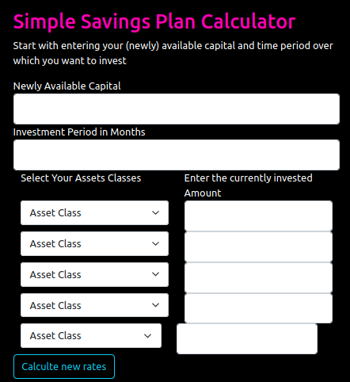

# Simple Savings Plan Calculator
A simple savings plan calculator to keep your portfolio balanced.



## Development

Currently this web app is still under construnction, however, if you wish, you can download the code and run in locally.
This web app uses Flask and Python. Here's a quick setup:

```bash
source env/bin/activate
export FLASK_APP=home
flask run
```
Please note, that you should create a virtual environment for pyhton. This directory 'env' as well as other Python files are listed in the .gitignore file.
